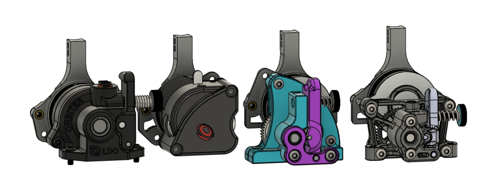

# Mounting Solution for Mellow SHT-36
The current files align with the motor orientation of the following extruders: 
* Sherpa Mini
* LGX Lite
* Sailfin
* Orbiter v1.5
* Orbiter v2.0.  

Be sure which version of Orbiter you have before printing.  They use different motor orientations.  Mini Afterburner should be able to utilize the Sherpa Mini plate.  I haven't looked at mounting for AB/SB yet, but plan to at least see what kind of mess it might be.  The brackets for Sailfin and Orbiter will work if mirrored on X, to match mirrored extruders.  If there's a common extruder with a different motor orientation that I missed, just message me on Discord.  Since these boards carry an adxl345, its important to have them oriented perpendicular to the movement axes of the printer.

Here's what it looks like in CAD on an LGX Lite:
 

There are now 3 types of plates available: plain, strain relief, and overmold strain relief.  Each has a dedicated folder for the related stls.  The basic strain relief is for most diy cables.  The overmold strain relief is for retail cables available from Molex, as shown below.  The size of the fittings dictated a new bracket to suit it.  There is a single step file in the CAD folder that contains all the parts.

It seems as though the output for the stepper can be switched to the other side of the board if the user wanted it so.  The bracket base geometry has clearance for that in regular and mirrored orientation.  

These plates are meant to work with mounting posts, like the strain relief on Voron v0.  Each end of the post gets an M3 heatset insert.  Mounting post length should be chosen based on the motor you are using.  Measure the distance from the back of the motor to the back side of the mounting ears.  Add .5-1mm so the board mount isnt touching the motor, and print the corresponding post length from the folder.  

There are 3 styles of post available.  They print in the orientation shown.  The classic round ones are fine as long as you print hot enough that layer adhesion is strong.  Geometry is in place to allow the internal overhang to print easily.  If that makes you uneasy, choose the hex or teardrop shapes and print them lying down as shown.  
  
